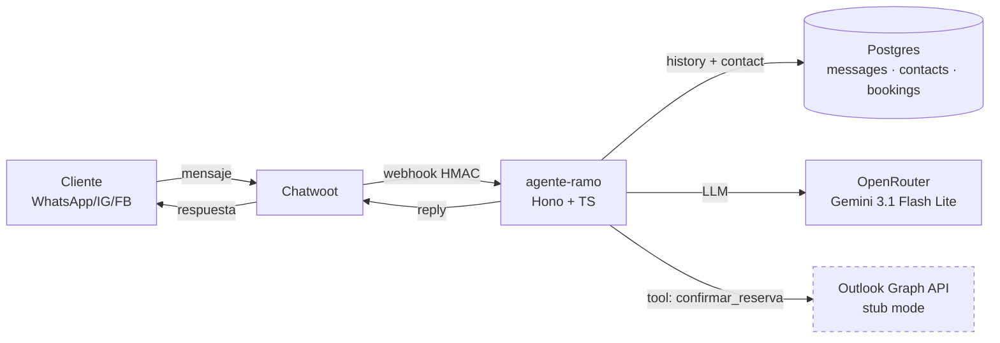
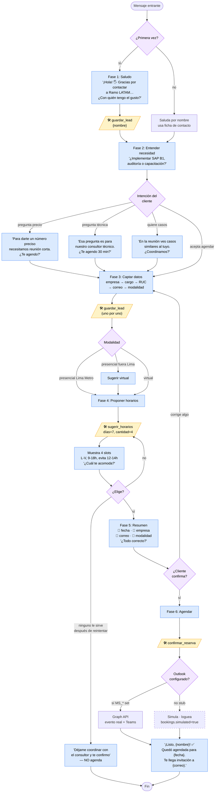

<div align="center">

# 🤖 agente-ramo

**Agente conversacional con IA para Ramo LATAM — Partner SAP Business One**
Atiende clientes por WhatsApp/Instagram/Facebook vía Chatwoot, recopila leads y agenda consultorías gratuitas en Outlook.


</div>

---

## 📖 Qué hace

- Recibe mensajes entrantes desde **Chatwoot** (WhatsApp, Instagram, Facebook, Email, SMS, API…).
- Responde con un **LLM** (Gemini 3.1 Flash Lite vía OpenRouter) siguiendo un prompt pulido específico para Ramo LATAM (tono cálido-profesional peruano, sin promesas comerciales).
- Recopila progresivamente los datos del lead: nombre, empresa, cargo, RUC, correo, necesidad, modalidad.
- Propone 3-4 slots de **consultoría gratuita de 30 min** (horario Lima L-V 9-18h, evitando almuerzo 12-14h).
- Al confirmar, agenda en **Outlook 365** (modo stub activo hasta que se configuren credenciales de Microsoft).
- Persiste historial y perfil en **Postgres**.

---

## 🏗️ Arquitectura



---

## 💬 Flujo de conversación

Diagrama exacto del prompt en `src/services/system-prompt.ts`.



**Reglas firmes del prompt:**
1. Una sola pregunta por turno, mensajes cortos (2-4 líneas).
2. `guardar_lead` apenas haya un dato nuevo — no esperar a tener todo.
3. Nunca inventar horarios: siempre `sugerir_horarios`.
4. `confirmar_reserva` solo después del "sí" al resumen.
5. No dar precios, no responder técnico profundo, no prometer tiempos → derivar al consultor humano.
6. Un cliente con cita ya agendada NO re-agenda.
7. Fechas al cliente siempre en formato humano ("martes 16 de abril, 10:00 a. m.").
8. Zona horaria: Lima (GMT-5) fija, todo el tiempo.

---

## 🔌 Endpoints HTTP

| Método | Ruta | Descripción |
|--------|------|-------------|
| `GET`  | `/` | Healthcheck. `{status, service: "agente-ramo"}` |
| `POST` | `/webhook` | Webhook de Chatwoot (acepta HMAC en `X-Chatwoot-Signature`) |
| `POST` | `/webhook/chatwoot` | Alias de `/webhook` |

---

## 🛠 Tools del agente

Archivo: `src/services/tools.ts`

| Tool | Cuándo la llama el LLM |
|------|------------------------|
| `guardar_lead` | Cada vez que el cliente entrega un dato nuevo (nombre, empresa, RUC, correo, etc.) |
| `sugerir_horarios` | Antes de pedir que elija día/hora. Genera slots L-V, 9-18, evitando almuerzo |
| `confirmar_reserva` | Solo tras el "sí" al resumen. Crea evento Outlook (real o stub) y persiste en `bookings` |

---

## 🗄️ Modelo de datos

```sql
messages  (id, subscriber_id, contact_key, role, content, created_at)
contacts  (contact_key PK, name, phone, email, ruc, empresa, cargo,
           necesidad, modalidad, notes, first_seen, last_seen)
bookings  (id, contact_key FK, event_id, simulated, scheduled_at,
           duration_min, modalidad, email_cliente, topic, created_at)
```

`contact_key` es estable por canal: `wa:+51…`, `ig:handle`, `em:correo@…`, `cw:<id>` como fallback. Así aunque Chatwoot reasigne IDs, el bot reconoce al cliente.

---

## 📂 Estructura

```
src/
├── index.ts                      # Hono bootstrap, rutas
├── config.ts                     # Zod env validation, reglas de negocio Ramo
├── types.ts                      # ChatMessage, Contact, ChatwootWebhookPayload
├── handlers/
│   └── webhook.ts                # Valida HMAC, extrae sender/conv, dispara process
└── services/
    ├── agent.ts                  # generateText con tools, Gemini 3.1 Flash Lite
    ├── chatwoot.ts               # POST messages a Chatwoot API
    ├── database.ts               # postgres.js — messages, contacts, bookings
    ├── outlook-calendar.ts       # Graph API · stub mode automático
    ├── system-prompt.ts          # Prompt en español neutro LATAM (~5k tokens)
    └── tools.ts                  # guardar_lead, sugerir_horarios, confirmar_reserva
migrations/
└── 001_init.sql                  # Schema inicial
```

---

## 🚀 Setup local

```bash
git clone git@github.com:stivenrosales/agente-ramo.git
cd agente-ramo
cp env.example .env               # completa OPENROUTER_API_KEY, CHATWOOT_*, DATABASE_URL
npm install
npm run migrate                   # crea tablas
npm run dev                       # http://localhost:3000
```

---

## ⚙️ Variables de entorno

Ver [`env.example`](./env.example). Resumen:

| Variable | Requerida | Notas |
|---|---|---|
| `OPENROUTER_API_KEY` | ✅ | Key de OpenRouter |
| `CHATWOOT_BASE_URL` | ✅ | `https://app.chatwoot.com` o self-hosted |
| `CHATWOOT_ACCOUNT_ID` | ✅ | ID numérico de la cuenta |
| `CHATWOOT_API_TOKEN` | ✅ | User Access Token (perfil) |
| `CHATWOOT_INBOX_IDS` | 🔲 | Filtrar inboxes permitidos (CSV) |
| `DATABASE_URL` | ✅ | Postgres |
| `DATABASE_SSL` | 🔲 | `disable` · `no-verify` · `require` (default: `disable`) |
| `WEBHOOK_SECRET` | 🔲 | Si está seteado, valida HMAC-SHA256 `X-Chatwoot-Signature` |
| `MS_TENANT_ID` | 🔲 | Microsoft Entra — activa Outlook real |
| `MS_CLIENT_ID` | 🔲 | Microsoft — activa Outlook real |
| `MS_CLIENT_SECRET` | 🔲 | Microsoft — activa Outlook real |
| `MS_CALENDAR_MAILBOX` | 🔲 | Email del buzón (ej. `robert.flores@ramolatam.com`) |
| `RAMO_TIMEZONE` | 🔲 | Default `America/Lima` |
| `RAMO_BUSINESS_HOURS` | 🔲 | Default `09:00-18:00` |
| `RAMO_LUNCH_BLOCK` | 🔲 | Default `12:00-14:00` |
| `RAMO_BOOKING_DURATION_MIN` | 🔲 | Default `30` |

**Stub de Outlook**: si las 4 `MS_*` quedan vacías, el bot simula el agendamiento (responde al cliente como si hubiera reservado) y loguea `[outlook:stub]`. Apenas se llenen las 4, el modo real Graph API se activa automáticamente.

---

## 🐳 Deploy (Docker / EasyPanel)

`Dockerfile` multi-stage incluido. En EasyPanel:

1. New App → GitHub → `stivenrosales/agente-ramo`
2. Build: Dockerfile · Port: 3000
3. Pegar env vars
4. Configurar dominio + Let's Encrypt
5. En Chatwoot → **Settings → Integrations → Webhooks**:
   - URL: `https://TU-DOMINIO/webhook`
   - Subscripción: **Message Created**
   - HMAC Token: el mismo valor que `WEBHOOK_SECRET`

---

## 🔐 Seguridad

- Todas las credenciales como env vars. Nunca commitear `.env`.
- `WEBHOOK_SECRET` → validación HMAC-SHA256 del body contra `X-Chatwoot-Signature` (`node:crypto` + `timingSafeEqual`).
- API token de Chatwoot se usa en header `api_access_token` (nunca en URL).
- Cuando se active Outlook real, usar **Application Access Policy** para restringir la app al buzón único.

---

## 📝 Licencia

Privado · Ramo LATAM.
