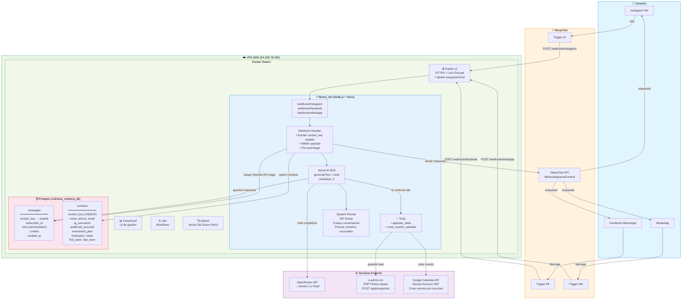
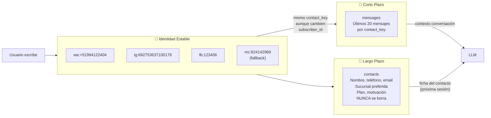
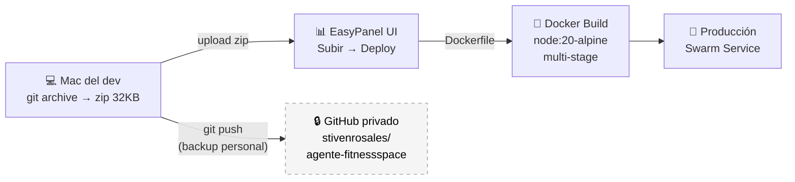

# Arquitectura del Agente Fitness Space

## Flujo completo del sistema

```mermaid
flowchart TB
    subgraph USUARIOS["📱 Usuarios"]
        IG["Instagram DM"]
        FB["Facebook Messenger"]
        WA["WhatsApp"]
    end

    subgraph MANYCHAT["🤖 ManyChat"]
        MC_IG["Trigger IG"]
        MC_FB["Trigger FB"]
        MC_WA["Trigger WA"]
        MC_API["ManyChat API<br/>/fb/sending/sendContent"]
    end

    subgraph VPS["☁️ VPS AWS (54.235.78.205)"]
        subgraph SWARM["Docker Swarm"]
            TRAEFIK["🔒 Traefik v3<br/>HTTPS + Let's Encrypt<br/>*.vlpwhz.easypanel.host"]
            
            subgraph AGENT["⚡ fitness_bot (Node.js + Hono)"]
                ROUTES["/webhook/instagram<br/>/webhook/facebook<br/>/webhook/whatsapp"]
                HANDLER["Webhook Handler<br/>• Extraer contact_key estable<br/>• Validar payload<br/>• Fire-and-forget"]
                LLM_CALL["Vercel AI SDK<br/>generateText + tools<br/>maxSteps: 5"]
                TOOLS["🔧 Tools<br/>• agendar_visita<br/>• crear_evento_calendar"]
                PROMPT["System Prompt<br/>397 líneas<br/>5 fases conversación<br/>Precios, horarios, sucursales"]
            end

            subgraph POSTGRES["🗄️ Postgres (colmena_colmena_db)"]
                MESSAGES["messages<br/>━━━━━━━━━━━━━━━━<br/>contact_key ← estable<br/>subscriber_id<br/>role (user/assistant)<br/>content<br/>created_at"]
                CONTACTS["contacts<br/>━━━━━━━━━━━━━━━━<br/>contact_key (UNIQUE)<br/>name, phone, email<br/>ig_username<br/>preferred_sucursal<br/>investment_plan<br/>motivation, notes<br/>first_seen, last_seen"]
            end

            EP["📊 EasyPanel<br/>UI de gestión"]
            N8N["⚙️ n8n<br/>Workflows"]
            QDRANT["🔍 Qdrant<br/>Vector DB (futuro RAG)"]
        end
    end

    subgraph EXTERNAL["🌐 Servicios Externos"]
        OPENROUTER["OpenRouter API<br/>→ Gemini 3.1 Flash"]
        ERP["e-admin.mx<br/>ERP Fitness Space<br/>POST /api/prospectos"]
        GCAL["Google Calendar API<br/>Service Account JWT<br/>Crear eventos por sucursal"]
    end

    %% User → ManyChat
    IG -->|DM| MC_IG
    FB -->|Mensaje| MC_FB
    WA -->|Mensaje| MC_WA

    %% ManyChat → Agent
    MC_IG -->|"POST /webhook/instagram"| TRAEFIK
    MC_FB -->|"POST /webhook/facebook"| TRAEFIK
    MC_WA -->|"POST /webhook/whatsapp"| TRAEFIK
    TRAEFIK --> ROUTES

    %% Agent internal flow
    ROUTES --> HANDLER
    HANDLER -->|"upsert contacto"| CONTACTS
    HANDLER -->|"cargar historial (20 msgs)"| MESSAGES
    HANDLER --> LLM_CALL
    LLM_CALL --> PROMPT
    LLM_CALL -->|"si confirma cita"| TOOLS

    %% Agent → External
    LLM_CALL -->|"chat completion"| OPENROUTER
    TOOLS -->|"guardar lead"| ERP
    TOOLS -->|"crear evento"| GCAL

    %% Save + respond
    LLM_CALL -->|"guardar respuesta"| MESSAGES
    HANDLER -->|"enviar respuesta"| MC_API

    %% ManyChat → User
    MC_API -->|"respuesta"| IG
    MC_API -->|"respuesta"| FB
    MC_API -->|"respuesta"| WA

    %% Styling
    style USUARIOS fill:#e1f5fe,stroke:#0288d1,color:#000
    style MANYCHAT fill:#fff3e0,stroke:#f57c00,color:#000
    style VPS fill:#e8f5e9,stroke:#388e3c,color:#000
    style SWARM fill:#f1f8e9,stroke:#689f38,color:#000
    style AGENT fill:#e3f2fd,stroke:#1976d2,color:#000
    style POSTGRES fill:#fce4ec,stroke:#c62828,color:#000
    style EXTERNAL fill:#f3e5f5,stroke:#7b1fa2,color:#000
```

## Memoria: 2 capas

```mermaid
flowchart LR
    subgraph SHORT["🧠 Corto Plazo"]
        M["messages<br/>Últimos 20 mensajes<br/>por contact_key"]
    end

    subgraph LONG["💾 Largo Plazo"]
        C["contacts<br/>Nombre, teléfono, email<br/>Sucursal preferida<br/>Plan, motivación<br/>NUNCA se borra"]
    end

    subgraph IDENTITY["🔑 Identidad Estable"]
        WA_KEY["wa:+51994122404"]
        IG_KEY["ig:692753637100178"]
        FB_KEY["fb:123456"]
        MC_KEY["mc:824142968<br/>(fallback)"]
    end

    MSG_IN["Usuario escribe"] --> IDENTITY
    IDENTITY -->|"mismo contact_key<br/>aunque cambien<br/>subscriber_id"| SHORT
    IDENTITY --> LONG
    SHORT -->|"contexto conversación"| LLM["LLM"]
    LONG -->|"ficha del contacto<br/>(próxima sesión)"| LLM
```

## Flujo de deploy

```mermaid
flowchart LR
    DEV["💻 Mac del dev<br/>git archive → zip 32KB"]
    VPS_EP["📊 EasyPanel UI<br/>Subir → Deploy"]
    DOCKER["🐳 Docker Build<br/>node:20-alpine<br/>multi-stage"]
    LIVE["🚀 Producción<br/>Swarm Service"]

    DEV -->|"upload zip"| VPS_EP
    VPS_EP -->|"Dockerfile"| DOCKER
    DOCKER --> LIVE

    GH["🔒 GitHub privado<br/>stivenrosales/<br/>agente-fitnessspace"]
    DEV -->|"git push<br/>(backup personal)"| GH

    style GH fill:#f5f5f5,stroke:#999,stroke-dasharray: 5 5,color:#000
```
